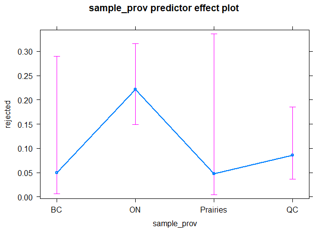
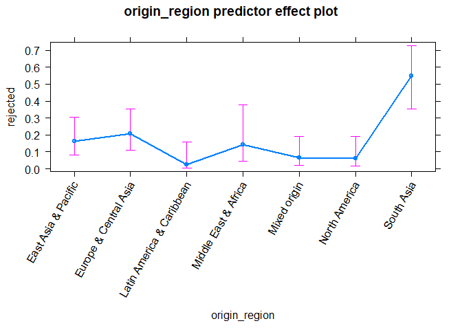
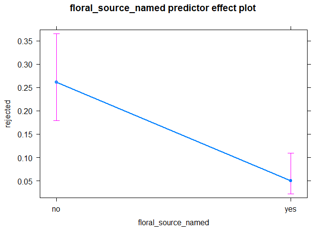
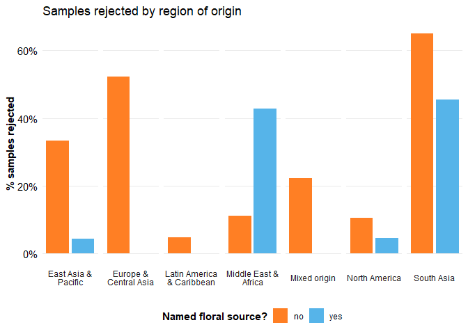
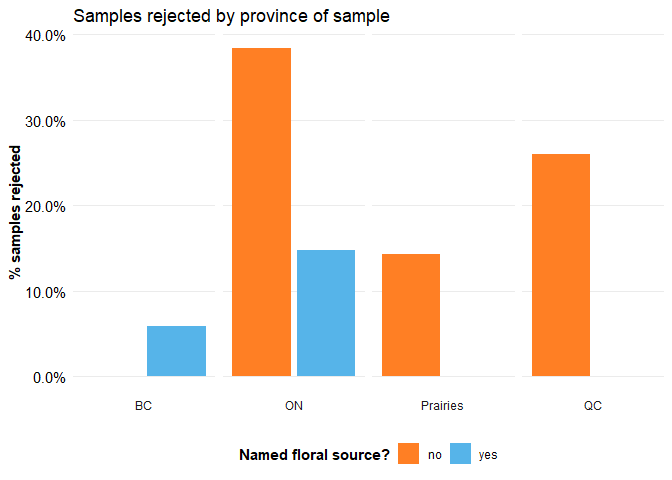

Honey Purity in Canada
================
Mitchell Xiao Xiao Li

## Introduction

There should be only one ingredient in a jar of honey, but sometimes,
manufacturers like to get *creative*. Therefore, in 2018-2019, the
Canadian Food Inspection Agency (CFIA) sampled 240 random jars of honey
from across the country, and checked whether they exceed the expected
threshold for non-honey sugar. The publicly-available results comprise
dataset I will be using for this project, which includes information
about the province in which the sample was taken, the country of origin
for the product, the floral source of the honey, the amount of non-honey
sugars, and whether or not the sample was judged as satisfactory,
according to the CFIA
(<https://open.canada.ca/data/en/dataset/7ecfee4c-b6f5-45f8-9fd4-16976f55f8d9>).

This will be an exploratory analysis with the goal of determining if
changes in province of sampling, country of origin, or floral source
increase the likelihood of an unsatisfactory rating. The ideal model
will be a logistic regression with the rating as the outcome variable
and province of sampling, country of origin, and floral source as
predictor variables, but the specific structure will depend on what the
data look like. A generalized linear regression model with the same
effects structure could be run on the content of non-honey sugars (coded
as C4 content in the dataset), however, the satisfactory/unsatisfactory
outcome variable was chosen due to a lack of specialized knowledge about
honey testing and how much C4 content is permitted in a sample before it
is deemed unsatisfactory.

``` r
# loading necessary packages
library(tidyverse)
library(effects)
library(ggplot2)
library(countrycode)
library(lmtest)

# reading the data
honey <- read_csv("honey.csv")
```

## Initial data cleaning

Reading the data already shows that some irrelevant columns need to be
deleted and the remaining columns need to be renamed to be shorter and
friendlier to computers.

``` r
# printing the column names of the dataset in a list
colnames(honey)
```

    ##  [1] "Sample # - No d'échantillon"                                
    ##  [2] "Sampled From – Lieu d'échantillonnage"                      
    ##  [3] "Declared Country of Origin"                                 
    ##  [4] "Pays d'origine déclaré"                                     
    ##  [5] "Declared Floral Source"                                     
    ##  [6] "Source florale déclarée"                                    
    ##  [7] "Calculated C4 Sugar Addition – Addition de sucre C4 calculé"
    ##  [8] "SIRA Assessment – Évaluation d'ARIS"                        
    ##  [9] "NMR Assessment – Évaluation de RMN"                         
    ## [10] "Sample Assessment – Évaluation d'échantillon"

``` r
# removing two redundant columns for country of origin and floral source in 
# French, as well as the SIRA and NMR assessment columns (this analysis
# will only be concerned with the sample assessment column)
# also renaming the columns
honey <- honey %>% 
  select(!c(4,6,8,9)) %>%
  rename(
    sample_num = "Sample # - No d'échantillon",
    sample_prov = "Sampled From – Lieu d'échantillonnage",
    origin_country = "Declared Country of Origin",
    floral_source = "Declared Floral Source",
    C4_content = "Calculated C4 Sugar Addition – Addition de sucre C4 calculé",
    rejected = "Sample Assessment – Évaluation d'échantillon"
  )
```

The analysis will be a logistic regression model with “rejected” as the
outcome variable, so the values need to be changed to TRUE and FALSE and
the vector needs to be changed to a logical format.

``` r
# checking that there are only two types of values in the column, and counting
# how many rows include each type of value, this also shows that this will be
# a useful outcome variable, as roughly 1/5 of samples are rejected
table(honey$rejected)
```

    ## 
    ##   S U-I 
    ## 188  52

``` r
# replacing "S" (satisfactory) with FALSE and "U-I" (unsatisfactory) with TRUE
honey$rejected <- honey$rejected %>%
  replace(honey$rejected=="S", FALSE) %>%
  replace(honey$rejected=="U-I", TRUE)

# changing the format of rejected in the honey dataset
honey <- honey %>%
  mutate(rejected = as.logical(rejected))
```

The next parts will examine the predictors and make them suitable for
use in a logistic model.

# Predictor preparation

First, the sample\_prov predictor.

``` r
# counting the values of sample_prov
unique(honey$sample_prov)
```

    ## [1] "AB" "ON" "QC" "BC" "MB" "SK"

For sample province, there were only 6 provinces (from British Columbia
to Quebec) that were included in the samples, so this column will be
changed to a factor so that the data can be analyzed by province. Before
deeming it ready for use, since will be a categorical predictor in a
logistic regression model, it needs one final check for complete or
quasi-complete separation, which is when all values of a predictor
correspond to a single value of the outcome variable, rather than being
dispersed across the two levels of the outcome variable. Since a
logistic regression model will treat each level of the factor as a
separate parameter to estimate, this means that all levels of all
factors will need to fully cross the outcome variable. This is checked
by counting the values of the predictor variable for sample\_prov.

``` r
# checking for separation
table(honey$rejected, honey$sample_prov)
```

    ##        
    ##         AB BC MB ON QC SK
    ##   FALSE 11 23  3 97 52  2
    ##   TRUE   1  1  0 37 13  0

We see that a large proportion of the samples come from Ontario and
Quebec. The dataset does not specify whether this was due to convenience
or due to a larger number of honey products available in those
provinces. In addition, it does not specify how the data collection team
handled cases where a brand of honey was available in more than one
province, and how they decided on a province to draw that sample from,
which may explain this pattern.

It also looks like for the small number of samples taken in Manitoba and
Saskatchewan, there were no rejected samples. This will be handled by
grouping the Prairie provinces (Alberta, Manitoba, and Saskatchewan) in
a new level of sample\_prov, so that this new level fully crosses the
outcome variable. While this reduces specificity in the results of the
model, it still allows for the initial hypotheses to be answered, and
increases the stability of the model (explanation of separation and
possible solutions from
<https://stats.idre.ucla.edu/other/mult-pkg/faq/general/faqwhat-is-complete-or-quasi-complete-separation-in-logisticprobit-regression-and-how-do-we-deal-with-them/>).

``` r
# replacing all values of "AB", "SK", and "MB" with "Prairies"
honey$sample_prov <- honey$sample_prov %>%
  str_replace_all(c("AB" = "Prairies",
                    "SK" = "Prairies", 
                    "MB" = "Prairies"))

# recoding sample_prov to a factor
honey <- honey %>% mutate(sample_prov = as.factor(sample_prov))

# checking for separation again
table(honey$rejected, honey$sample_prov)
```

    ##        
    ##         BC ON Prairies QC
    ##   FALSE 23 97       16 52
    ##   TRUE   1 37        1 13

Great, the sample\_prov predictor is now ready. Next, the
origin\_country predictor.

``` r
# printing all the unique values of origin_country by their spread across the
# outcome variable, to check the number of levels and for separation
table(honey$rejected, honey$origin_country)
```

    ##        
    ##         Argentina Australia Australia, Brazil Austria Brasil, Australia
    ##   FALSE         2         7                 2       3                 3
    ##   TRUE          0         1                 0       0                 0
    ##        
    ##         Brasil, Uruguay, India Brazil Brazil, Mexico Canada Croatia
    ##   FALSE                      0     19              2     19       2
    ##   TRUE                       1      1              0      0       0
    ##        
    ##         Cuba, Mexico, Argentina France Germany Greece India India, Thailand
    ##   FALSE                       1     11       2      1    12               1
    ##   TRUE                        0      0       3      8    14               1
    ##        
    ##         India, Uruguay, Viet Nam India, US Iran Israel Italy Mexico
    ##   FALSE                        1         1    0      3     7      1
    ##   TRUE                         0         0    1      3     0      0
    ##        
    ##         Mexico, Brasil Mexico, Cuba, Argentina, Uruguay Mexico, Thailand
    ##   FALSE              2                                2                1
    ##   TRUE               0                                0                0
    ##        
    ##         Moldova Myanmar, Thailand Netherlands New Zealand Pakistan Portugal
    ##   FALSE       1                 0           2          21        0        1
    ##   TRUE        0                 1           0           1        4        0
    ##        
    ##         Romania Saudi Arabia Spain
    ##   FALSE       4            7     2
    ##   TRUE        0            0     0
    ##        
    ##         Spain, Mexico, Guatemala, Ukraine, Bulgaria, Thailand
    ##   FALSE                                                     4
    ##   TRUE                                                      0
    ##        
    ##         Taiwan, prov. China Thailand Turkey Ukraine USA USA, Argentina
    ##   FALSE                   0        6      3       1  19              1
    ##   TRUE                    2        1      1       0   3              0
    ##        
    ##         USA, Viet Nam, India, Uruguay Viet Nam Zambia
    ##   FALSE                             3        6      2
    ##   TRUE                              1        5      0

It looks like there are a lot unique values, which would also lead to
separation if country of origin was used as a factor predictor, so the
data need to be grouped. Going by high-frequency levels will not work
here, because the biggest groups combined (Brazil, Canada, New Zealand,
and the USA) only account for less than 50% of the values, and there are
some samples that have a mixture of origins. This indicates that the
original idea of using country of origin as an outcome variable needs to
be modified so that a broader grouping variable, like continent, can be
used as a predictor instead.

But first, it looks like there are two spellings of “Brazil”, namely
“Brasil” and “Brazil”. The function that will be used to match values
in the country of origin varialbe to a continent uses a specific
spelling, so first, all the values of “Brasil” need to be changed to
“Brazil”, for consistency.

``` r
# replacing all instances of "Brasil" with "Brazil" in the honey dataset
honey$origin_country <- honey$origin_country %>%
    str_replace("Brasil", "Brazil")
```

Now the countrycode package can be used to generate values for continent
of origin, based on the country of origin values. However, “continent”
as defined by the package merges North and South America, which would
merge three of the largest groups in country of origin (this is also why
latitude was not used to group the data, the distinctions between South
America, south Asia, and Oceania would be blurred). Therefore the data
will be grouped by “region”, of which there are seven, as defined by the
World Bank Development Indicators
(<https://datahelpdesk.worldbank.org/knowledgebase/articles/906519>).

``` r
# Using the countrycode function from the countrycode package to match the
# origin_country values from the honey dataset to a region. This function takes
# a vector (specified by sourcevar), defines its values (specified by origin) 
# and matches it to its corresponding value in the destination specification

regions <- countrycode(sourcevar = honey$origin_country,
                       origin = "country.name",
                       destination = "region")
```

    ## Warning in countrycode(sourcevar = honey$origin_country, origin = "country.name", : Some values were not matched unambiguously: Australia, Brazil, Brazil, Australia, Brazil, Mexico, Brazil, Uruguay, India, Cuba, Mexico, Argentina, India, Thailand, India, Uruguay, Viet Nam, Mexico, Brazil, Mexico, Cuba, Argentina, Uruguay, Mexico, Thailand, Myanmar, Thailand, Spain, Mexico, Guatemala, Ukraine, Bulgaria, Thailand, USA, Argentina, USA, Viet Nam, India, Uruguay

    ## Warning in countrycode(sourcevar = honey$origin_country, origin = "country.name", : Some strings were matched more than once, and therefore set to <NA> in the result: Australia, Brazil,East Asia & Pacific,Latin America & Caribbean; Brazil, Australia,East Asia & Pacific,Latin America & Caribbean; Brazil, Mexico,Latin America & Caribbean,Latin America & Caribbean; Brazil, Uruguay, India,Latin America & Caribbean,South Asia,Latin America & Caribbean; Cuba, Mexico, Argentina,Latin America & Caribbean,Latin America & Caribbean,Latin America & Caribbean; India, Thailand,South Asia,East Asia & Pacific; India, Uruguay, Viet Nam,South Asia,Latin America & Caribbean,East Asia & Pacific; Mexico, Brazil,Latin America & Caribbean,Latin America & Caribbean; Mexico, Cuba, Argentina, Uruguay,Latin America & Caribbean,Latin America & Caribbean,Latin America & Caribbean,Latin America & Caribbean; Mexico, Thailand,Latin America & Caribbean,East Asia & Pacific; Myanmar, Thailand,East Asia & Pacific,East Asia & Pacific; Spain, Mexico, Guatemala, Ukraine, Bulgaria, Thailand,Europe & Central Asia,Latin America & Caribbean,Latin America & Caribbean,Europe & Central Asia,East Asia & Pacific,Europe & Central Asia; USA, Argentina,Latin America & Caribbean,North America; USA, Viet Nam, India, Uruguay,South Asia,North America,Latin America & Caribbean,East Asia & Pacific

The warning shows that after matching the values that could be matched,
some values couldn’t be matched and were returned as NA, which separates
the single-origin honey samples (the ones that could be matched) from
the mixed origin samples (that generated an NA). In the next section,
the NA values are replaced with “mixed origin” and then the values from
the region vector are added to the honey dataset in a new column called
“origin\_region”.

``` r
# sanity check, to see if there are a reasonable number of NA values (27 seems
# appropriate, given the table() output for origin_country)
sum(is.na(regions))
```

    ## [1] 27

``` r
# replacing the NA values with "Mixed origin"
regions <- regions %>% replace_na("Mixed origin")

# checking if any NA values remain
sum(is.na(regions))
```

    ## [1] 0

``` r
# adding an origin_region column to the honey dataset using add_column, with
# the contents of the regions variable
honey <- add_column(honey, origin_region=regions)

# manual check of how well the regions correspond to the origin countries
as.data.frame(table(honey$origin_region, honey$origin_country)) %>%
  filter(Freq>1)
```

    ##                          Var1
    ## 1   Latin America & Caribbean
    ## 2         East Asia & Pacific
    ## 3                Mixed origin
    ## 4       Europe & Central Asia
    ## 5   Latin America & Caribbean
    ## 6                Mixed origin
    ## 7                Mixed origin
    ## 8               North America
    ## 9       Europe & Central Asia
    ## 10      Europe & Central Asia
    ## 11      Europe & Central Asia
    ## 12      Europe & Central Asia
    ## 13                 South Asia
    ## 14               Mixed origin
    ## 15 Middle East & North Africa
    ## 16      Europe & Central Asia
    ## 17               Mixed origin
    ## 18               Mixed origin
    ## 19      Europe & Central Asia
    ## 20        East Asia & Pacific
    ## 21                 South Asia
    ## 22      Europe & Central Asia
    ## 23 Middle East & North Africa
    ## 24      Europe & Central Asia
    ## 25               Mixed origin
    ## 26        East Asia & Pacific
    ## 27        East Asia & Pacific
    ## 28      Europe & Central Asia
    ## 29              North America
    ## 30               Mixed origin
    ## 31        East Asia & Pacific
    ## 32         Sub-Saharan Africa
    ##                                                     Var2 Freq
    ## 1                                              Argentina    2
    ## 2                                              Australia    8
    ## 3                                      Australia, Brazil    2
    ## 4                                                Austria    3
    ## 5                                                 Brazil   20
    ## 6                                      Brazil, Australia    3
    ## 7                                         Brazil, Mexico    2
    ## 8                                                 Canada   19
    ## 9                                                Croatia    2
    ## 10                                                France   11
    ## 11                                               Germany    5
    ## 12                                                Greece    9
    ## 13                                                 India   26
    ## 14                                       India, Thailand    2
    ## 15                                                Israel    6
    ## 16                                                 Italy    7
    ## 17                                        Mexico, Brazil    2
    ## 18                      Mexico, Cuba, Argentina, Uruguay    2
    ## 19                                           Netherlands    2
    ## 20                                           New Zealand   22
    ## 21                                              Pakistan    4
    ## 22                                               Romania    4
    ## 23                                          Saudi Arabia    7
    ## 24                                                 Spain    2
    ## 25 Spain, Mexico, Guatemala, Ukraine, Bulgaria, Thailand    4
    ## 26                                   Taiwan, prov. China    2
    ## 27                                              Thailand    7
    ## 28                                                Turkey    4
    ## 29                                                   USA   22
    ## 30                         USA, Viet Nam, India, Uruguay    4
    ## 31                                              Viet Nam   11
    ## 32                                                Zambia    2

One last step, which is to again check for separation.

``` r
# checking for separation
table(honey$rejected, honey$origin_region)
```

    ##        
    ##         East Asia & Pacific Europe & Central Asia Latin America & Caribbean
    ##   FALSE                  40                    40                        22
    ##   TRUE                   10                    12                         1
    ##        
    ##         Middle East & North Africa Mixed origin North America South Asia
    ##   FALSE                         10           23            38         13
    ##   TRUE                           4            4             3         18
    ##        
    ##         Sub-Saharan Africa
    ##   FALSE                  2
    ##   TRUE                   0

It looks like most levels are okay, except for Sub-Saharan Africa, which
had no rejected samples. To solve this, those values will be grouped
with Middle East & North Africa to create a new level called “Middle
East & Africa”. Again, this is not ideal, but it will allow the model to
run smoothly.

``` r
# replacing all values of "Middle East & North Africa" and "Sub-Saharan Africa"
# with "Middle East & Africa"
honey$origin_region <- honey$origin_region %>%
  str_replace_all(c("Middle East & North Africa" = "Middle East & Africa",
                    "Sub-Saharan Africa" = "Middle East & Africa"))

# recoding origin_region to a factor
honey <- honey %>% mutate(origin_region = as.factor(origin_region))

# checking for separation again
table(honey$rejected, honey$origin_region)
```

    ##        
    ##         East Asia & Pacific Europe & Central Asia Latin America & Caribbean
    ##   FALSE                  40                    40                        22
    ##   TRUE                   10                    12                         1
    ##        
    ##         Middle East & Africa Mixed origin North America South Asia
    ##   FALSE                   12           23            38         13
    ##   TRUE                     4            4             3         18

With the country of origin (now region of origin) predictor ready, the
next sections deal with the floral\_source predictor.

``` r
# printing all the unique values of floral_source by their spread across the
# outcome variable, to check the number of levels and for separation
table(honey$rejected, honey$floral_source)
```

    ##        
    ##         acacia alfalfa avocado blossom beechwood blossom canola canola, alfalfa
    ##   FALSE     14       1               1         1       8      1               1
    ##   TRUE       1       0               0         0       0      0               0
    ##        
    ##         chestnut citrus blossom clover flower and conifer forest forest blossom
    ##   FALSE        2              1      5                  1      1              1
    ##   TRUE         0              0      0                  0      0              0
    ##        
    ##         forest honey lavender linden Linden Manuka multiflower Neem
    ##   FALSE            1        2      1      1     20           1    1
    ##   TRUE             0        0      0      0      1           0    3
    ##        
    ##         orange blossom rata sidr starthistle blossom strawberry sunflower
    ##   FALSE              4    1    0                   0          1         1
    ##   TRUE               0    0    1                   1          0         0
    ##        
    ##         undeclared White Himalayan wild berry wildflower ziziphus blossom
    ##   FALSE         95               2          1         17                1
    ##   TRUE          42               0          0          2                1

It looks like there are fewer levels of floral\_source (but still too
many to use as a factor) and the majority of samples do not have a
declared floral source, but among the named ones, wildflower and Manuka
are the most common. To use this data in the analysis, a new grouping
column (floral\_source\_named) in the honey dataframe will be created
that determines whether the sample has a named floral source (separating
by undeclared versus other values in floral\_source), to see if naming a
floral source has an influence on the likelihood of pure honey.

``` r
# using the ifelse() function to go through the floral_source column and assign
# values based on whether the value matches "undeclared" (assigns FALSE if it
# matches, assigns TRUE in all other conditions)
named <- ifelse(honey$floral_source=="undeclared", "no", "yes")

# adding a floral_source_named column to the honey dataframe, containing the 
# contents of the variable "named"
honey <- add_column(honey, floral_source_named=named)

# checking for separation in the new column
table(honey$rejected, honey$floral_source_named)
```

    ##        
    ##         no yes
    ##   FALSE 95  93
    ##   TRUE  42  10

``` r
# making the new column a factor
honey <- honey %>%  mutate(floral_source_named = as.factor(floral_source_named))
```

With the data processing done, the next section will build the model.

## Modelling

The first model is a logistic regression model with sample province,
region of origin, and whether the floral source was named as outcome
variables, and whether the sample failed to pass inspection as the
outcome. Ideally, the different levels of country of origin and floral
source would have been incorporated as random factors, but the way that
the data are structured does not allow for the fixed effects to cross
all levels of the (would-be) random effect, so they were not included.
In addition, if the data had allowed for it, interactions between the
predictors would have been included to check if the effects would change
at different levels, but there are not enough samples per cell for the
model to run if interactions had been included.

``` r
mod_full <- glm(rejected ~ sample_prov + origin_region + floral_source_named,
            data=honey, 
            family="binomial")
summary(mod_full)
```

    ## 
    ## Call:
    ## glm(formula = rejected ~ sample_prov + origin_region + floral_source_named, 
    ##     family = "binomial", data = honey)
    ## 
    ## Deviance Residuals: 
    ##     Min       1Q   Median       3Q      Max  
    ## -1.8879  -0.6823  -0.3013  -0.1237   2.6309  
    ## 
    ## Coefficients:
    ##                                        Estimate Std. Error z value Pr(>|z|)    
    ## (Intercept)                            -1.92945    1.10164  -1.751  0.07987 .  
    ## sample_provON                           1.70407    1.07688   1.582  0.11356    
    ## sample_provPrairies                    -0.03873    1.58747  -0.024  0.98054    
    ## sample_provQC                           0.59046    1.14049   0.518  0.60465    
    ## origin_regionEurope & Central Asia      0.28640    0.53397   0.536  0.59171    
    ## origin_regionLatin America & Caribbean -2.08998    1.10502  -1.891  0.05858 .  
    ## origin_regionMiddle East & Africa      -0.15941    0.74313  -0.215  0.83015    
    ## origin_regionMixed origin              -1.02571    0.69986  -1.466  0.14276    
    ## origin_regionNorth America             -1.10183    0.75137  -1.466  0.14253    
    ## origin_regionSouth Asia                 1.82328    0.56542   3.225  0.00126 ** 
    ## floral_source_namedyes                 -1.89438    0.46148  -4.105 4.04e-05 ***
    ## ---
    ## Signif. codes:  0 '***' 0.001 '**' 0.01 '*' 0.05 '.' 0.1 ' ' 1
    ## 
    ## (Dispersion parameter for binomial family taken to be 1)
    ## 
    ##     Null deviance: 250.88  on 239  degrees of freedom
    ## Residual deviance: 188.69  on 229  degrees of freedom
    ## AIC: 210.69
    ## 
    ## Number of Fisher Scoring iterations: 6

Interpreting the numerical output from this model is difficult without
transforming the estimates into probabilities, so an effect plot for
each factor will be used to aid understanding. In a logistic regression,
even without interaction terms, each predictor depends on the level of
the other predictors, so the package used to create the plot (called
Effects) predicts probabilites at an “intermediate” level of the other
predictors. First, the sample\_prov predictor plot.

``` r
# plotting the effect sizes for all levels of sample_prov, since type is set
# to response, the estimates are converted to probabilities and not plotted
# as log odds, which are the estimates in the model summary
plot(predictorEffects(mod_full, "sample_prov"), axes=list(y=list(type="response")))
```

<!-- -->

And now, transforming the estimates into probabilities.

``` r
# saving the estimates (coefficients) from summary(mod_full) into variables for 
# each province slope 
intercept <- coef(mod_full)[1]
slope_ON <- coef(mod_full)[2]
slope_Prairies <- coef(mod_full)[3]
slope_QC <- coef(mod_full)[4]

# applying the plogis() function to the sum of the necessary coefficients to
# calculate a prediction for a given province; the sum is in terms of log odds
# and plogis() transforms them into probabilities
# output is not shown in the document as the probabilities will be discussed in
# the following paragraph
plogis(intercept)
plogis(intercept+slope_ON)
plogis(intercept+slope_Prairies)
plogis(intercept+slope_QC)
```

For this predictor, the reference level is British Columbia (represented
by the intercept) which is the estimate to which all other estimates are
adjustments. From both the plot and the signs and magnitudes of the
estimates, samples from Ontario are the most likely to be rejected with
Quebec second most likely, compared to BC, and samples from the Prairies
very slightly less likely to be rejected, compared to BC. At the
reference level for all the other predictors (sample from the East Asia
& Pacific region, no declared floral source), the predicted probability
for rejection was 0.13 for sample from BC and 0.12 for a sample from the
Prairies (logit difference = -0.039, standard error = 1.587, z-score =
-0.024, p = 0.98), however, the wide confidence intervals on the plot
indicate that these estimates may not be reliable indicators of an
effect. Comparatively, for a sample from Ontario, the predicted
probability of rejection was 0.44 (logit difference = +1.704, *SE* =
1.077, *z* = 1.582, p = 0.11), and 0.21 for a sample from Quebec (logit
difference = +0.590, *SE* = 1.140, *z* = 0.518 p = 0.60).

The p-values from all of these estimates do not indicate that there is
enough evidence to reject the null hypothesis, which is that there is no
difference in likelihood for a rejected sample between BC and the
province in question, however, given that this is a speculative
exporatory analysis, the statistical significance of these predictors is
not of paramount importance. The main takeaway from this predictor is
that samples from Ontario, then Quebec, are more likely to be rejected
than samples from BC and the Prairies, which could also be due to larger
proportions of the samples coming from Ontario and Quebec.

Next, the origin\_region effect plot.

<!-- -->

Again, transforming the estimates for this predictor into probabilities
in the same way as previously done for the different levels of the
sample province predictor.

``` r
# saving the estimates (coefficients) from summary(mod_full) into variables for 
# each region of origin slope, the intercept is not included here because it
# was already saved from before
slope_Europe_CentralAsia <- coef(mod_full)[5]
slope_LatinAmerica_Caribbean <- coef(mod_full)[6]
slope_MiddleEast_Africa <- coef(mod_full)[7]
slope_Mixed_origin <- coef(mod_full)[8]
slope_NorthAmerica <- coef(mod_full)[9]
slope_SouthAsia <- coef(mod_full)[10]

# transforming coefficients into probabilities with plogis() again, same as
# above, and output is again not shown but will be discussed in the text
plogis(intercept)
plogis(intercept+slope_Europe_CentralAsia)
plogis(intercept+slope_LatinAmerica_Caribbean)
plogis(intercept+slope_MiddleEast_Africa)
plogis(intercept+slope_Mixed_origin)
plogis(intercept+slope_NorthAmerica)
plogis(intercept+slope_SouthAsia)
```

For this predictor, the reference level is East Asia & Pacific. Samples
from Europe & Central Asia and South Asia are more likely to be
rejected, the former of which shows a small magnitude of difference from
East Asia & Pacific and the latter of which shows a much larger increase
in likelihood, demonstrated on the plot and in the sign and magnitude of
the estimates. At reference levels for the other predictors (sample from
BC and no declared floral source), the predicted probability for a
rejected sample from Europe & Central Asia was 0.16 (logit difference =
+0.286, *SE* = 0.534, *z* = 0.536, p = 0.59) and it was 0.47 for a
sample from South Asia (logit difference = +1.823, *SE* = 0.565, *z* =
3.225, p = 0.001).

All other origin regions were less likely than East Asia & Pacific to
have a sample rejected, demonstrated both on the plot and by the sign of
the estimate. The smallest reduction in likelihood was for samples
Middle East & Africa with a predicted probability of 0.11 (logit
difference = -0.159, *SE* = 0743, *z* = -0.215, p = 0.83), followed by
samples of mixed origin with a predicted probability of 0.049 (logit
difference = -1.026, *SE* = 0.700, *z* = -1.466, p = 0.14), and samples
from North America with a predicted probability of 0.046 (logit
difference = -1.102, *SE* = 0.751, *z* = -1.466, p = 0.14). The largest
reduction in likelihood was for samples from Latin America & the
Caribbean with a predicted probability of 0.02 (logit difference =
-2.090, *SE* = 1.105, *z* = -1.891, p = 0.059). No estimates reached
significance at the alpha = 0.05 level, with the exception of the
estimate for South Asia (logit difference = +1.823, *SE* = 0.565, *z* =
3.225, p = 0.001), indicating that for all the other regions, there is
not enough evidence to reject the null hypothesis of no differences in
likelihood between any given origin region and the East Asia & Pacific
region. The estimate for Latin America & the Caribbean is approaching
significance (logit difference = -2.090, *SE* = 1.105, *z* = -1.891, p =
0.059), but without more data, the reliability of this effect cannot be
determined.

Finally, the floral\_source\_declared effect plot.

<!-- -->

And transforming the estimate into a probability.

``` r
# saving the estimate for floral_source_namedyes into a variable
slope_floral_named_yes <- coef(mod_full)[11]

# using the plogis() function on the intercept and the estimate for named 
# floral source to get the probability of rejection
plogis(intercept)
plogis(intercept+slope_floral_named_yes)
```

This was the effect with the largest t-value, indicating that there was
a significant difference between different levels of this predictor.
There was a large negative estimate for the ‘yes’ level, indicating that
honeys that had declared a floral source were significantly less likely
to be rejected than ones that had not. At the reference level of all the
other predictors (samples from BC, with an origin region of East Asia &
Pacific), the estimated probability of rejection is 0.02 for a sample
with a named floral source (logit difference = -1.894, *SE* = 0.461, *z*
= -4.105, p \< 0.0001), compared to a 0.13 probability of rejection for
samples without a named floral source at the reference level of the
toher predictors. This is indicates that under the null hypothesis (no
difference between samples with and without a declared floral source),
these results are very unlikely.

Finally, to determine which of the predictors are predicting more of the
variance, a series of single-predictor models were built and an AIC
model comparison was performed.

``` r
# building a model with only sample province as a predictor
mod_prov <- glm(rejected ~ sample_prov,
            data=honey, 
            family="binomial")

# building a model with only region of origin as a predictor
mod_region <- glm(rejected ~ origin_region,
            data=honey, 
            family="binomial")

# building a model with just floral_source_named as a predictor
mod_floral <- glm(rejected ~ floral_source_named,
                  data=honey, 
                  family="binomial")

# building a model with just no predictors as a comparison
mod_none <- glm(rejected ~ 1,
                  data=honey, 
                  family="binomial")

# AIC model comparison test
AIC(mod_full, mod_prov, mod_region, mod_floral, mod_none)
```

    ##            df      AIC
    ## mod_full   11 210.6894
    ## mod_prov    4 246.8918
    ## mod_region  7 232.7250
    ## mod_floral  2 238.5129
    ## mod_none    1 252.8752

The full model had the lowest AIC, making it the best fit, but it looks
like region of origin and floral source accounted for more of the data
on their own than the sampling province, so a model with just region of
origin and named floral source as predictors were built to determine if
the inclusion of sampling province in the full model was justified. This
time, a likelihood ratio test was used to determine if there was a
significant difference between the full model and one with just two
predictors.

``` r
# building a model with origin region and named floral source as predictors
mod_region_named <- glm(rejected ~ origin_region + floral_source_named,
                        data=honey, 
                        family="binomial")

# comparing the models to see which fits the data better
lrtest(mod_full,mod_region_named)
```

    ## Likelihood ratio test
    ## 
    ## Model 1: rejected ~ sample_prov + origin_region + floral_source_named
    ## Model 2: rejected ~ origin_region + floral_source_named
    ##   #Df  LogLik Df  Chisq Pr(>Chisq)  
    ## 1  11 -94.345                       
    ## 2   8 -99.411 -3 10.133    0.01747 *
    ## ---
    ## Signif. codes:  0 '***' 0.001 '**' 0.01 '*' 0.05 '.' 0.1 ' ' 1

The likelihood ratio test indicates that even though the inclusion of
the sampling province predictor did not account for much variation on
its own, the full model with all three predictors has a significantly
lower sum of log likelihoods than the model with the two strongest
predictors, so the addition of a third predictor in the full model was
justified.

## Plotting

The initial questions asked were very broad, and the general idea was to
try and determine how each factor (of origin country, sample province,
and floral source) influenced the likelihood of a sample being rejected.
After looking at the model, seems like there are some general trends,
with some more prominent than others, as indicated by their larger
t-values: The main goal of the plots is to demonstrate the named floral
source effect, across both region of origin and province of sample, and
the secondary goal is to indicate general trends for rejection rates
across region of origin and province of sample.

``` r
# creating a summarized version of the honey dataset that contains the
# proportion of samples that were rejected by origin_region and whether they
# had a named floral source
region_plot <- honey %>%
  group_by(floral_source_named, origin_region) %>%
  summarize(prop = (sum(rejected)/length(rejected))) %>%
  ungroup()

# initializing ggplot
ggplot(data=region_plot, aes(x=floral_source_named, y=prop)) +
  # adding a column geom, and specifying that the colours should correspond to
  # the levels of floral_source_named
  geom_col(aes(fill=floral_source_named)) +
  # labelling the y axis in terms of percentages
  scale_y_continuous(labels=scales::percent) +
  # creating a grid of plots by levels of origin_region
  facet_grid(
    cols = vars(origin_region),
    # moving the origin_region labels to the bottom of the plot
    switch="x",
    # specifying that the origin_region labels have a set width of 14 and
    # that they should wrap onto multiple lines
    labeller=label_wrap_gen(width=14,multi_line=TRUE)) +
  # manually setting the colours of the columns, specifically with a fill 
  # command, because the fill aesthetic for geom_col() was specified earlier
  scale_fill_manual(values=c("chocolate1", "#56B4E9")) +
  theme_minimal() +
  theme(
    # removes x-axis grid lines
    panel.grid.major.x = element_blank(),
    # removes major y-axis grid lines
    panel.grid.minor.y = element_blank(),
    # specifying the font size and colour for the axis labels
    axis.text = element_text(size=11, colour="black"),
    # specifying the font size, face, and colour for the axis titles
    axis.title = element_text(size=11, face="bold", colour="black"),
    # removing the x-axis title
    axis.title.x = element_blank(),
    # removing the x-axis labels
    axis.text.x=element_blank(),
    # removing the x-axis tick marks
    axis.ticks.x=element_blank(),
    # specifying the font face for the legend title
    legend.title = element_text(face="bold"),
    # moving the legend to the bottom
    legend.position = "bottom"
  ) + 
  # adding a title
  labs(title = "Samples rejected by region of origin") +
  # adding a y-axis label
  ylab("% samples rejected") +
  # changing the title of the legend
  guides(fill=guide_legend(title="Named floral source?"))
```

<!-- -->

This plot aims to demonstrate the high proportion of samples from South
Asia that were rejected, and show that samples without a declared floral
source are more likely to be rejected, even though there are some
strange cases due to low numbers of samples in some groups.

This next plot, constructed in the same way as the previous, aims to
demonstrate that samples from Ontario and Quebec are more likely to be
rejected, and that samples without a declared floral source are more
likely to be rejected overall, again despite low numbers in some groups.

<!-- -->

## Summary

Samples with a declared floral source (such as wildflower or Manuka)
were significantly more likely to be pure honey than ones that did not
declare a floral source. This is demonstrated in the plots where in each
region or province, the highest percentage of samples rejected were for
samples without a declared floral source, with the exception of samples
from the Middle East & Africa and samples drawn in BC (potentially due
to low numbers of samples in those groups). There was no significant
difference in rejection rates between samples drawn from different
provinces, however, the plots indicate that there are trends, where
samples from Ontario and Quebec are more likely to be rejected. Given
that samples from Ontario made up half of the data, more samples from
the other provinces are needed to determine whether this is a
statistically significant trend or due to chance. As well, samples from
South Asia were significantly more likely to be rejected, shown by their
higher overall percentages, but more data could determine whether the
higher rejection rates for samples Europe & Central Asia are significant
or due to chance.

These conclusions were drawn from a small dataset with observational
data, and it is possible that more data with equal samples in all cells
will reveal more results: For example, more data could confirm or deny
the pattern observed in the plot where samples that had a named floral
source originating from the Middle East & Africa or drawn in BC were
more likely to be rejected than samples without a named floral source,
but because the data were too few and not structured to answer these
more complex questions, there is no statistically reasoned answer.

In conclusion, this was an exploratory analysis on a small,
non-representative dataset that demonstrated potential trends that could
be investigated with more careful data collection, but does not make any
definitive claims. However, just in case the trends in this data are
reflected more broadly, I’ll be choosing honey a nice wildflower honey
for my next jar.
